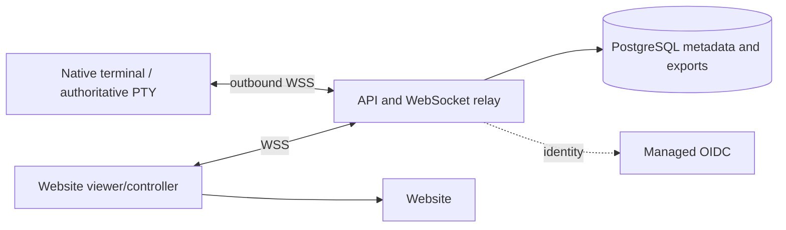

# Live web terminal and block sharing

## Product boundary

Terminal chat means live native terminal output in a browser and browser input returned to that
same native terminal. The Mac owns the shell, PTY, block model and command editor. The backend is
an authenticated relay and share store. It never launches shells or runs commands itself.

The latest clarification replaces the earlier interpretation completely. There is no inference
service, provider integration, assistant workflow or generated-command feature. Feature #31 is
brought forward only for planning web viewing/control; simultaneous co-typing/presence and the
local control daemon (#27) remain separate deferred work. Static sharing (#9) and export redaction
(part of #14) are planned together.

The existing terminal remains offline-capable. When streaming is off, allocate no encoder task,
network connection, capture cache or per-keystroke cloud work. When on, share one explicitly selected
pane. Native app UI remains AppKit/SwiftUI with the current design system.

## Small initial system

| Concern | Initial choice | Reason |
| --- | --- | --- |
| Backend | TypeScript, supported Node LTS, one API/relay codebase | one deployable service with bounded socket state |
| Website | TypeScript, same origin HTTP API, authenticated viewer/control UI | one session and authorization boundary |
| Metadata | managed PostgreSQL with backups / point-in-time recovery | account isolation, lifecycle and immutable exports |
| Live transport | WebSocket over TLS | output and input both travel on the persistent connection |
| Stream buffer | bounded in-memory relay ring, publisher-owned snapshots | no database writes for every terminal frame |
| Export content | immutable bounded JSON in PostgreSQL | atomically publish snapshot + link + grants |
| Identity | managed OIDC, internal account UUID mapping | local OS profile is not a cloud identity |
| Large media | private object storage only when images/large exports need it | avoid a premature upload subsystem |

[WebSocket](https://www.rfc-editor.org/rfc/rfc6455) supplies bidirectional framing. Application-level
epochs, ordering, authorization and acknowledgements below are still required.
No message broker, Redis, Kubernetes or extra daemon initially. One API/relay process and one
managed database suffice for the first measured pilot. Maintenance runs as a scheduled command
from the same codebase; it does not belong on the frame path.

Planned folders; create them only when implementing their phase:

| Path | Ownership |
| --- | --- |
| `app/src/terminal/shared_session/` | pane capture, lifecycle and visible control permissions |
| `app/src/cloud_object/` | export preview and link management |
| `crates/shared_session/src/` | pure snapshot/damage/input DTOs and protocol rules |
| `crates/cloud_objects/src/` | immutable export DTOs shared across features |
| `crates/cloud_object_client/src/` | auth and owned/cancellable networking |
| `crates/secret_redaction/src/` | selected export sanitization |
| `backend/src/{auth,shared_session,sharing}/` | handlers and socket relay |
| `backend/migrations/` | reviewed schema and role grants |
| `website/src/` | downloads, sign-in, live viewer/controller and static share viewer |

Only crates may be imported by multiple app features. Keep pure model code free of UI imports.
System-browser sign-in uses OAuth PKCE and Keychain credentials, following
[RFC 8252](https://www.rfc-editor.org/rfc/rfc8252). Sharing/control starts from an explicit native action.

## Authoritative state and efficient capture

Raw PTY bytes alone cannot reproduce this app: its detached editor, block boundaries and collapse
state do not all exist in the PTY stream. Mirror the native model using an initial versioned snapshot
followed by row/block damage deltas. This also avoids running a second VT parser with different
behavior on the website. Snapshot payloads include blocks, fixed cell geometry, graphemes/style,
cursor and alternate-screen mode, plus the active draft and UTF-16 selection. Selection overlays,
sidebar, history store and filesystem metadata are not captured. Stream a bounded recent block
window; older output stays local unless deliberately exported.

Browser rendering uses a fixed-cell canvas for grids and escaped text for command/block chrome.
Publisher columns/rows are authoritative. Browser clients fit/scroll that geometry; they do not
resize the PTY when their page resizes. Only the host changes terminal size in the first release.
Snapshot/delta render equivalence must cover nano, tmux, alternate screens, wide glyphs and IME.
Kitty/iTerm2 images are explicitly unsupported in protocol v1 until the media phase is implemented;
show placeholders, not corrupted frames.

Use existing dirty-line identities and session updates. Coalesce damage to a maximum 30 frames/sec,
send only changed rows, and pause encoding when no viewer is attached. Apply a bounded outbound
queue; slow sockets resync or disconnect rather than slowing PTY reads. No network await inside
the terminal parser or drawing path. Full snapshot construction goes off-main from an immutable
bounded capture. Never skip a mode/size boundary without a snapshot barrier.

## Browser control and uncertainty

Initial controller: the signed-in owner, explicitly enabled from the native app. Invited accounts
can view later; writing requires a controller grant AND a current controller lease approved by the
host. One browser owns that lease. Local keyboard input takes precedence and revokes remote control
before applying the local event; no simultaneous co-typing in v1.

Inputs carry publisher epoch, controller lease, client ID and monotonic input sequence. The relay
checks authenticated permission and lease, and the native publisher checks them again before
applying. The host serializes accepted inputs through the existing editor/TerminalInput paths.
At a prompt, text editing/undo/redo/paste affects the detached editor; in a raw program it follows
normal terminal key/paste encoding. Never append a newline to a browser paste automatically.

Ack means the host accepted/applied input to its editor or PTY write queue, not that a command ran
or succeeded. Store only a bounded in-memory dedup cursor per controller lease on the host. Neither
relay nor browser automatically retries unacknowledged inputs after a broken connection. Reconnect
revokes that lease and creates a new epoch/controller lease. Old inputs are rejected; uncertain
input is shown as such. This favors avoiding duplicate commands over pretending exactly-once
shell effects can be guaranteed. Offline control is disabled and inputs are never queued for later.

## Auth, revocation and privacy

Native connects outbound only; no listening port on the user's Mac. Website uses Secure HttpOnly
same-origin session cookies, CSRF protection on HTTP writes and an exact Origin allowlist for
WebSocket upgrades. Authentication occurs before admitting terminal traffic. One-use 30-second
socket tickets are sent in the first authenticated protocol frame, never in logged URLs. Until
authenticated, allow only that small frame and a five-second timeout. Tickets bind session, role,
device/account and generation; keep only their hashes in relay memory.

Changing permissions, stopping streaming, device/account deactivation and logout close affected
sockets and revoke input leases. Authorize every input. On any relay/database authorization failure,
fail closed for remote input; the local terminal continues. The relay renews its DB publisher lease
before expiry; it stops all traffic if renewal fails. Route control mutations to that session's
relay and close/update the sockets before acknowledging revocation. Host also revokes control
locally when streaming ends, regardless of network delivery.

A live stream contains whatever the selected terminal currently displays, including possible
credentials. Show this clearly when starting it; do not claim export regex redaction makes live
VT/editor content safe. Automatic live-output masking (#14) remains a separate feature with its own
rendering/performance requirements. Never record stream payloads or input text in server logs/DB.
Use TLS; the relay sees payloads in this initial design, so do not claim end-to-end encryption.

Static exports are different: before the first content upload, show the exact selected, sanitized
sealed blocks in a native preview. Strip raw escape streams, OSC controls, executable HTML and
active links. Normalize home paths. Client redacts known secret patterns and server checks again.
Preview is necessary because pattern matching cannot prove absence of secrets. Cap exports at
20 blocks / 2 MiB JSON. The web viewer uses escaped text and allowlisted styles.

An export link is `/s/<locator>#<256-bit-secret>`. Client generates and retains the secret across
idempotent retries; database stores its SHA-256. Viewer POSTs the secret (excluded from logs) to
resolve the snapshot. Restricted links additionally require a recipient grant. Check hash, expiry,
revocation, account status and grants on every read. Missing/denied uses the same 404. Generic page
metadata, no indexing/analytics, restrictive CSP/referrer policy and `private, no-store` responses
avoid leaking content into public caches. Revoke denies future reads, not copies already downloaded.

## SQL and operations

All private rows carry `owner_id`; composite foreign keys prevent cross-owner references. API
transactions set `swiftterm.user_id` from verified auth, never request JSON. Use transaction-local
`set_config(..., true)`, parameterized/schema-qualified queries and a non-owner application role.
RLS is enabled and forced. Owners ordinarily bypass RLS unless forced; superusers/BYPASSRLS always
bypass it. See [PostgreSQL row security](https://www.postgresql.org/docs/current/ddl-rowsecurity.html).

| Database role | Allowed scope |
| --- | --- |
| migration owner | DDL in migration jobs only |
| identity mapper | account identity lookup/insert only |
| owner API | RLS-scoped device/session/grant/export CRUD |
| relay authorization reader | narrow cross-owner SELECT on session/device/account/grant metadata |
| share reader | narrow SELECT on link/grant/snapshot/account rows after capability checks |
| maintenance | expired-session cleanup and deletion only |

These specialized exemptions need separate credentials and exact grants in B1. SQL policies alone
do not validate DTOs, enforce live input permission, make snapshots immutable or create deployment
roles. Browser/native never get SQL credentials. Account deactivation is checked on admission and
lease renewal. Revoke PUBLIC schema creation rights in deployment.

Initial load-test targets, not measured claims: 25 active publishers, 10 viewers each; bounded
8 MiB replay ring per session and 1 MiB pending data per socket; maximum 4 MiB snapshot split into
bounded chunks; 64 KiB frame limit. Cap active sessions per account, aggregate buffered bytes and
socket counts before admission. Evict old replay rows by byte/time budget; a gap requires a snapshot.
Monitor relay RSS, encoded bytes, queue lag, resync rate, input-ack latency, lease expiry and DB
pool wait using IDs/counters only. No per-frame database writes or idle native polling.

Scale relays by routing ALL `/live/<session-id>` traffic, including control mutations, to the same
instance using load-balancer consistent hashing. Store a fenced publisher epoch/lease in PostgreSQL;
a topology change or process failure forces publisher/viewers to reconnect, acquires a new epoch
and snapshots current state. Never use an in-process mutex as a cross-replica lock. If seamless
cross-node failover becomes a measured requirement, add a relay directory/broker in a separate
phase; v1 makes interruption visible. Budget query pools across replicas; sockets do not hold DB
connections. Start with 10 pool connections per relay, lease renewals batched off the frame path.

Live sessions expire within 24 hours unless explicitly extended; heartbeat loss pauses them and
stops input. Store session metadata for 7 days after end, no terminal transcript. Exports persist
until deleted, with expired/revoked links removed after a proposed 7-day grace and unreferenced
snapshots collected. Account deletion revokes immediately and purges primary content within 7 days.
Logs: proposed 14 days metadata only; backups: proposed 30 days, deletion ages out with them.
Confirm retention policy before public launch, restore a backup in a drill, and test migration
recovery and relay loss. Object storage, teams, billing and recording are separate future decisions.
